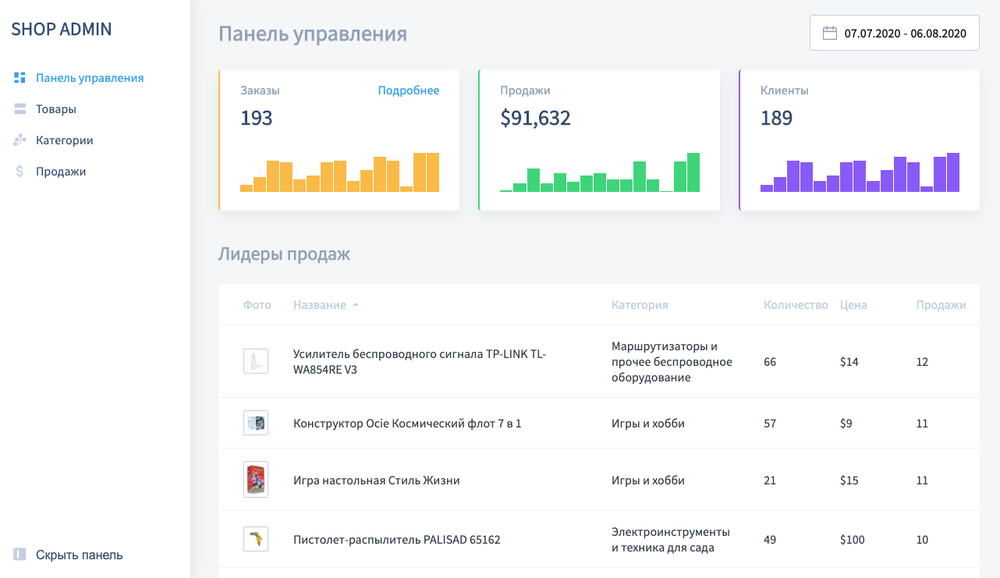

* nodejs >=16.13.1
* npm >= 7.10.0

Проект - это фронтенд часть типичной "Панели управления" для магазина товаров,
реализованная на чистом JavaScript.

## Preview

## Tech stack

Javascript
HTML
CSS
Webpack
NPM

## To start project in development mode:

* `npm install` - установит необходимые зависимости
* `npm run develop` - запустит "WebpackDevServer"

**Note:** Версии требуемые проектом указаны в `package.json` в поле `engines`

## To build project:

`npm run build` - "соберет" проект в "production" режиме.